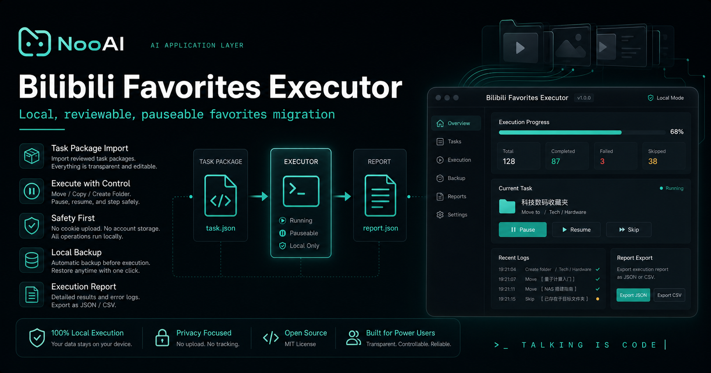
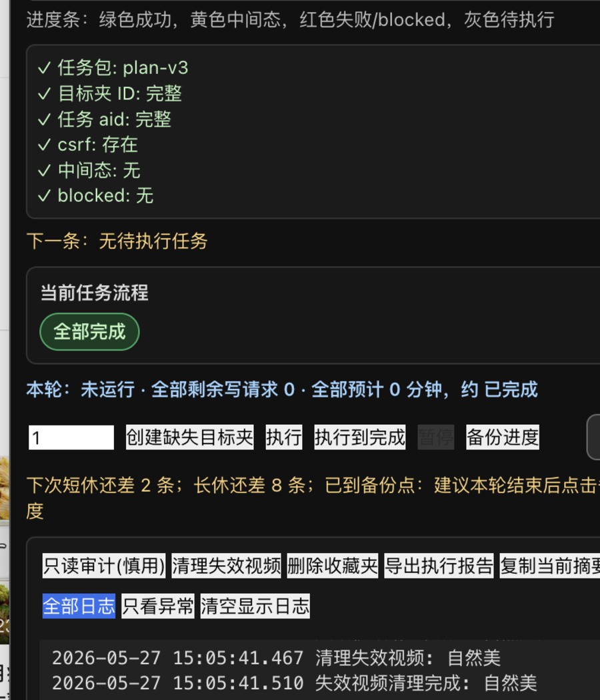
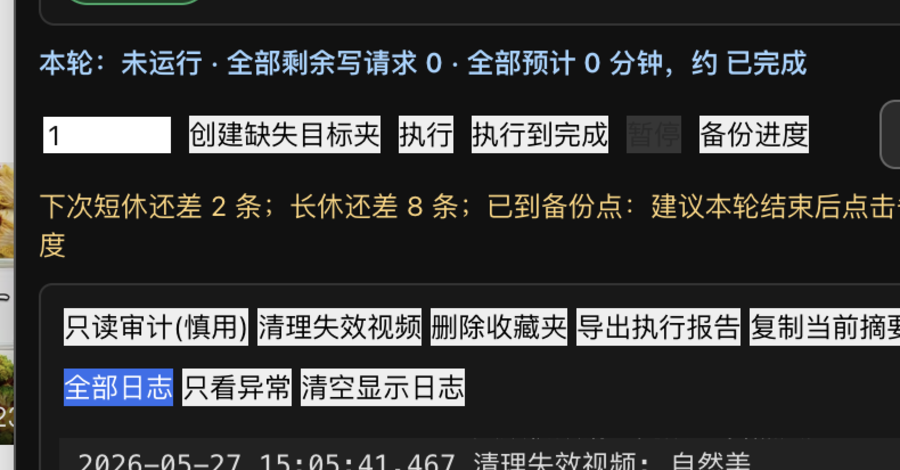

# Bilibili Favorites Executor

[English](README.en.md)



Bilibili Favorites Executor 是一个独立的 Tampermonkey/userscript 执行器。它在你已登录的 Bilibili 收藏夹页面内运行，导入已审核的任务包后，按保守节奏执行收藏夹迁移、复制、目标夹创建、暂停恢复、备份和报告导出。

本仓库只做 **Executor**。它不负责 AI 分类，也不采集视频内容到知识库。

设计说明：封面由 NooAI 视觉体系生成并整理，表达本地执行、人工审核、暂停恢复、备份和报告导出的核心边界。

## 效果图






## 组件边界

- **Plan Generator**：读取收藏夹和视频元数据，调用 AI 或规则生成任务包。本仓库不实现。
- **Executor**：导入任务包，在 Bilibili 页面上下文里执行 move/copy。本仓库主体。
- **Knowledge Collector**：采集视频元数据、字幕、摘要并写入本地知识库。后续独立项目。

任务包只服务“视频收藏分类迁移”。清理失效视频、删除收藏夹是页面小工具，不依赖任务包。

## 安装

1. 安装 Tampermonkey。
2. 打开 `bilibili_favorites_executor.user.js`。
3. 将完整脚本内容安装到 Tampermonkey。
4. 打开 Bilibili 个人空间的收藏夹页面：`https://space.bilibili.com/.../favlist`。
5. 页面右下角会出现执行器面板。

## 文件选择

- `bilibili_favorites_executor.user.js`：唯一发布脚本，适合审查、调试和安装到 Tampermonkey。

## 快速开始

1. 先准备并人工审核任务包，格式见 [任务包契约](docs/task-package-schema.md)。
2. 在 Bilibili 收藏夹页面右下角面板点击 `选择文件`，导入任务包 JSON。
3. 如提示缺少目标夹，点击 `创建缺失目标夹`。
4. 点击 `备份进度`，保存初始状态。
5. 小批次点击 `执行`，或确认后点击 `执行到完成`。
6. 过程中可随时点击 `暂停`，当前请求结束后会停下。
7. 完成后点击 `导出执行报告` 或 `备份进度` 留档。

## 语言

默认 UI 为中文。面板标题右侧提供 `EN` 按钮，可切换英文；偏好会保存到浏览器 `localStorage`。首版只翻译主 UI、按钮、关键提示和错误提示，历史日志不会强制重写。

## 安全模型

执行器采用保守策略：

- 在 Bilibili 页面上下文内 `fetch`，复用当前登录态。
- move 采用两步：先添加目标夹，再移出来源夹；中断时可恢复。
- 写操作之间有随机间隔。
- 批间有休息。
- 遇到 `403`、`412`、登录失效、csrf 缺失、写接口非成功码会立即挂起。
- 状态保存在本地 `localStorage`，可导出 JSON 备份。

详细说明见 [安全模型](docs/safety-model.md)。

## 页面维护工具

执行器还提供两个独立页面工具：

- `清理失效视频`：读取自建收藏夹列表，逐个调用 Bilibili clean 接口。
- `删除收藏夹`：读取自建收藏夹列表，显示视频数量，手动勾选后删除。

这些工具不读取任务包，也不会参与视频分类迁移。详细说明见 [页面维护工具](docs/cleanup-tools.md)。

## 示例任务包

见 [examples/tampermonkey-tasks.example.json](examples/tampermonkey-tasks.example.json)。

示例数据全部是脱敏假数据，不能直接用于真实账号。

## 免责声明

- 本项目是非官方工具，与 Bilibili 或上海宽娱数码科技有限公司无任何关联。
- 脚本仅在浏览器本地运行，不会上传 Cookie、SESSDATA、csrf、收藏夹列表或任务包到第三方服务器。
- 批量收藏夹操作可能触发 Bilibili 风控，例如 412、403、验证码、临时接口限制。
- 删除收藏夹和迁移收藏关系可能造成不可逆影响。执行前请先导出备份。
- 使用本工具产生的账号风险和数据风险由使用者自行承担。

## 开发验证

```bash
node --check bilibili_favorites_executor.user.js
python3 tests/test_static_contract.py
```

## License

MIT
